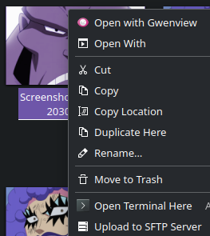

# Upload to SFTP Server

A context menu entry for Dolphin to upload file or folder to a specific SFTP Server.

Works on a file or on a folder.

# How to Use

1. Modify the variables in the .sh file
2. Put the sh file in your shell profile thingy
3. should work hehe

## Download

## Screenshots

